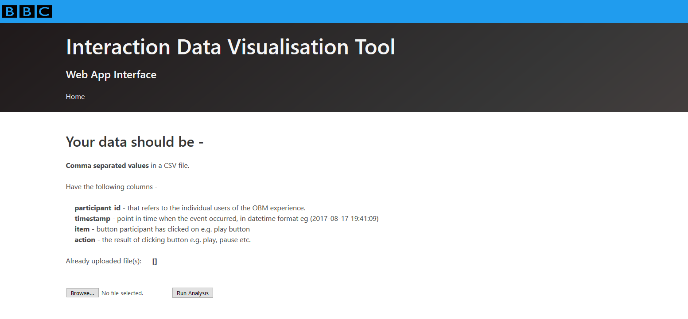

# Interaction Data Visualisation Tool (IDVT)
<!-- TOC depthFrom:1 depthTo:6 withLinks:1 updateOnSave:1 orderedList:0 -->

- [Interaction Data Visualisation Tool (IDVT)](#interaction-data-visualisation-tool-idvt)
	- [Installation](#installation)
		- [Requirements](#requirements)
				- [Windows](#windows)
				- [Linux](#linux)
				- [Windows](#windows)
				- [Linux](#linux)
		- [Run Flask App on Development Server](#run-flask-app-on-development-server)
				- [Windows](#windows)
				- [Linux](#linux)
		- [External Deployment Options](#external-deployment-options)
	- [Usage](#usage)
		- [Essential Columns](#essential-columns)
		- [Run Analysis](#run-analysis)
		- [Results](#results)
	- [License](#license)

<!-- /TOC -->



A web based data visualisation tool for the initial
analysis of low level interaction data taken from object based user experiences.

The IDVT takes the data and creates a set of plots that visualise the type and density
of clicks, as well as summary statistics such as total number of clicks, average number of clicks per second and total time taken.

## Installation

### Requirements

##### Windows

    - Python 3.6 +
    - virtualenv
    - Git Bash
    - Command Line Interface
    - Python IDE / Text editor

    NOTE: All commands that use "git" are done in Git Bash. It lets you use MinGW/Linux tools with Git at the command line.


##### Linux

    - Python 3.6 +
    - virtualenv
    - Git
    - Command Line Interface
    - Python IDE / Text editor

 ### Clone Repo

 `git clone https://github.com/UoMResearchIT/bbc_data_flask_app.git`

 ### Install Packages

##### Windows

```
$ virtualenv <virtualenv_name>
$ <virtualenv_name>\Scripts\activate
$ pip install -r requirements.txt
```
##### Linux

```
$ virtualenv <virtualenv_name>
$ source <virtualenv_name>/bin/activate
$ pip install -r requirements.txt
```

Latest requirements can be viewed [here](https://github.com/UoMResearchIT/bbc_data_flask_app/blob/master/requirements.txt)

### Run Flask App on Development Server

##### Windows

```
$ C:\path\to\app>set FLASK_APP=app.py
$ flask run
```

##### Linux

 ```
$ export FLASK_APP=app.py
$ flask run
```


### External Deployment Options

[Refer to Flask Documentation ](http://flask.pocoo.org/docs/1.0/deploying/)

## Usage

The Web App is designed to take a CSV file with comma separated values as input then runs Python scripts that will output various visualisations.

### Essential Columns

* **participant_id** - that refers to the individual users of the interactive experience.
* **timestamp** - point in time when the event occurred, in datetime format eg (2017-08-17 19:41:09)
* **item** - button participant has clicked on e.g. play button
* **action** - the result of clicking button e.g. play, pause etc.

All other columns needed will be generated by either `data_pre_pro.py` or `create_stats.py`

### Run Analysis

Clicking Run Analysis will take the CSV file uploaded by the user and create visualisations using the open source
[Plotly for Python](https://github.com/plotly/plotly.py)

It will run the following scripts -

* `data_pre_pro.py` - pre processes the data to get rid of inf, and NAN values.
Will also create the 'time_diff' and 'action_item' columns needed for the plots.

* `action_item.py` - takes the processed data and plots the type of clicks (i.e action_item) across time.

* `click_density.py` - plots the density of clicks across a 300 second (5 minute intervals)

* `create_stats.py`- creates a CSV of the statistical data such as click count,time taken in minutes/seconds, clicks per minute/second, minutes/secs per click.
this is then used to create histograms.

* `histogram_click_count.py`, `histogram_clicks_per_min.py` and `histogram_time_taken.py` create histograms based on the click count, clicks per minute and time taken.

Each data file uploaded by the user will create its own directory in `static/output` to store the relevant outputs.

All plots and an HTML version of the stats are also saved in `templates/` to be rendered by the `vis.html` template.

### Results

Once the scripts have finished running the results are displayed using the `vis.html` template. Each is interactive with controls such as zoom in/out, pan, select etc in the Plotly toolbar.

The results are displayed in the following order -

1. **Click Type** - Hovering over will display the Participant ID, Action Item and Time (in Minutes). Action Item can be filtered on the right to narrow down the type of click a user wants displayed.
The "compare data on hover" option in the Plotly toolbar is useful if want to see all the types of clicks at a particular time.
2. **Click Density** - Hovering over will display the Participant ID, Interval time and Number of events in that interval. Participants can be filtered on the right.
3. **Click Count** - Hovering over will display the number of participants and the bin size (automatically set depending on data)
4. **Clicks Per Minute** - Hovering over will display the number of participants and the bin size (automatically set depending on data)
5. **Time Taken (in Minutes)** - Hovering over will display the number of participants and the bin size (automatically set depending on data)
6. **Table of Stats** - A table of the stats generated by `create_stats.py`.

Each plot can be downloaded as a HTML by clicking the 'Download .... as HTML' button, or as PNG by clicking the camera icon that is part of the Plotly toolbar.

A CSV of Table of Stats can be downloaded via the 'Download as CSV' button.  

## License
