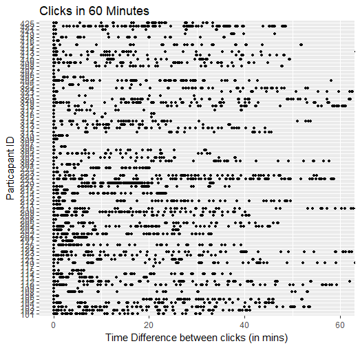
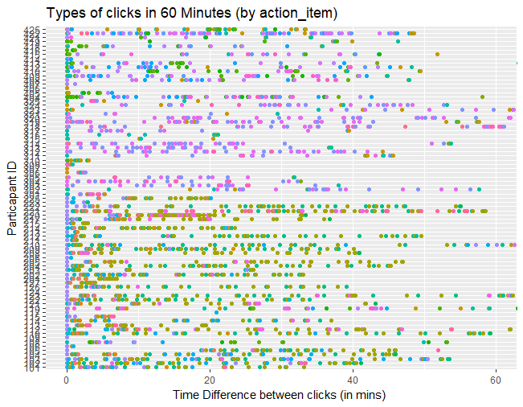

# Interaction Data Visualisation Tool (IDVT)

<!-- TOC depthFrom:1 depthTo:6 withLinks:1 updateOnSave:1 orderedList:0 -->

- [Interaction Data Visualisation Tool (IDVT)](#interaction-data-visualisation-tool-idvt)
	- [Introduction](#introduction)
	- [Problem](#problem)
	- [What Does The Tool Do?](#what-does-the-tool-do)
	- [Analysing Results](#analysing-results)
	- [Future Development](#future-development)
	- [Acknowledgments](#acknowledgments)

<!-- /TOC -->

## Introduction

Interaction data is messy, there is a lot of it; making it is challenging to read and difficult to work with due to the number of unique features.

I created a web based data visualisation tool for the initial analysis of low level interaction data taken from user experiences. It provides a way to create abstractions and visualisations of the data to inform a feature selection process that can tease out audience behaviours.  

## Problem

The original goal was to create visualisations from interaction data from
[CAKE](https://www.bbc.co.uk/taster/pilots/cook-along-kitchen-experience)
(Cook-Along Kitchen Experience). An OBM (Object Based Media) experience from the BBC. Over that time the potential was seen in a generalised tool that could be used for future experiences to speed up the reading of audience behaviour.

Initial visualisations were done using [R](https://www.r-project.org/) and the [tidyverse](https://www.tidyverse.org/) package. R is a language designed for statistical computing and data visualisation so it was quick and easy to use for pre processing the data and for initial analysis.

Below are two examples. More can be found [here](tests/r/results), along with R Workbooks that go through step by step the thought process.

The problem was these plots are, they lack interactivity, which makes it easier to explore the data without having to constantly writing new scripts to make a new plot based on a feature or data point that you wanted a closer look at. (Note the number of graphs in the [results folder](tests/r/results)) Shiny, an R package that can build interactive plots that could be deployed to the web app seemed like a logical option. Unfortunately the plots couldn't be shared easily as they required the recipient to have [R](https://www.r-project.org/) and [RStudio](https://www.rstudio.com/) installed, and the it couldn't give the flexibility needed to deploy on our own servers.

It was necessary to look outside the R ecosystem. After looking at different languages and data visualisation frameworks, Python seemed the most obvious solution. I had prior knowledge using it with Django and Wagtail which would be useful for deployment and Python also offered a much bigger range of data visualisation packages to choose from. Of those, [Plotly for Python](https://plot.ly/d3-js-for-python-and-pandas-charts/), was the strongest candidate because it creates interactive plots by default, the output is an HTML file serialised with JSON, so are lightweight and easily shareable, and could be embedded in web pages.

> The results of these can be found [here](tests/python/results). Unfortunately due to the size of the HTML files, they can't be rendered in Github. To view, download file then open in browser.

[Dash](https://plot.ly/products/dash/), produced by the same team behind Plotly uses [Flask](http://flask.pocoo.org/) to create a dashboard interface that provides more user control over interactivity; allowing for written user input, dropdown controls and the like; as well the layout such as multiple plots on a single page and providing space to add Markdown for descriptive text.  

> The results of these can be found [here](tests/python/src/dash_app).To view see README.md

The potential was there to bring these scripts together as a more generalised tool that could be used for future OBM experiences at the BBC or indeed any type of interaction data. It was decided to build a web app because it would be easier to deploy and update as well as for users to access.

Django and Wagtail were considered as potential frameworks but were a bit heavy for what would be a two page web app. I eventually settled on Flask. It's lightweight, quick and easy to develop for, and I already had some indirect experience with it using Dash.

In the end Dash wasn't used as while it has many advantages as detailed earlier, it doesn't have a method for downloading a PNG or an interactive HTML file. These are important if they are to be easily shared with others or added to research papers. If these features are eventually implemented in Dash it would be worth considering adding to a IDVT.    

## What Does The Tool Do?

The IDVT takes the interaction data and creates a set of plots that visualise the type and density of clicks, as well as summary statistics such as total number of clicks, average number of clicks per second and total time taken.

I built upon an existing project at BBC R&D, [musicMixSepratation](https://github.com/bbc/musicMixSeparation) that separates different instruments in an audio mix, but, at a basic level does the same thing as I wanted; take an input, applies some Python scripts and gives an output. I used their CSS and modified their templates, then added my own views in the `app.py` to add the logic behind the app, such as creating the directories for each new piece of data uploaded, running the scripts to create the plots, statistics etc.

The tool is designed to take a CSV file with comma separated values as an input. It needs to have the following columns:

* **participant_id** - that refers to the individual users of the interactive experience.
* **timestamp** - point in time when the event occurred, in datetime format eg (2017-08-17 19:41:09)
* **item** - button participant has clicked on e.g. play button
* **action** - the result of clicking button e.g. play, pause etc.

> All other columns needed will be generated by either `data_pre_pro.py` or `create_stats.py`

Once, "Run Analysis" is clicked, the following scripts will run -

* `data_pre_pro.py` - pre processes the data to get rid of inf, and NAN values.
Will also create the 'time_diff' and 'action_item' columns needed for the plots.

* `action_item.py` - takes the processed data and plots the type of clicks (i.e action_item) across time.

* `click_density.py` - plots the density of clicks across a 300 second interval (5 minute intervals)

* `create_stats.py`- creates a CSV of the statistical data such as click count, time taken in minutes/seconds, clicks per minute/second, minutes/secs per click.
this is then used to create histograms.

* `histogram_click_count.py`, `histogram_clicks_per_min.py` and `histogram_time_taken.py` create histograms based on the click count, clicks per minute and time taken.

All plots, and an HTML version of the stats are also saved in `templates/` to be rendered by the `vis.html` template. This is overwritten every time a new CSV file is uploaded, so plots are also save to `static/output/<CSV_filename>`

## Analysing Results

Once the scripts have finished running the results are displayed using the `vis.html` template. Each is interactive with controls such as zoom in/out, pan, select etc in the Plotly toolbar.

The results are displayed in the following order -

1. **Click Type** - Hovering over will display the Participant ID, Action Item and Time (in Minutes). Action Item can be filtered on the right to narrow down the type of click a user wants displayed.
The "compare data on hover" option in the Plotly toolbar is useful if want to see all the types of clicks at a particular time.
2. **Click Density** - Hovering over will display the Participant ID, Interval time and Number of events in that interval. Participants can be filtered on the right.
3. **Click Count** - Hovering over will display the number of participants and the bin size (automatically set depending on data)
4. **Clicks Per Minute** - Hovering over will display the number of participants and the bin size (automatically set depending on data)
5. **Time Taken (in Minutes)** - Hovering over will display the number of participants and the bin size (automatically set depending on data)
6. **Table of Stats** - A table of the stats generated by `create_stats.py`.

Each plot can be downloaded as a HTML by clicking the 'Download .... as HTML' button, or as PNG by clicking the camera icon that is part of the Plotly toolbar.

A CSV of Table of Stats can be downloaded via the 'Download as CSV' button.

These data points were chosen as they are fairly broad, meaning that the tool's user can ask an array of questions of the data. This means that the tool works for you rather than you working for the tool.

## Practical Uses for tool

The IDVT has been already been used to inform research into audience behaviour.

An earlier version was used in "Identifying Latent Indicators of Technical Difficulties from Interaction Data" by Jonathan Carlton, Joshua Woodcock, Andy Brown, John Keane, and Caroline Jay. The paper is an exploratory look at how technical difficulties could be identified through looking at audience interaction data.

It is a valuable area to explore as creating online interactive media is a time consuming and expensive process with the goal being audience engagement. Technical difficulties get in the way of the engagement process, thus if there was a way to predict or react to these faults it would be incredibly useful to broadcasters and media companies.

The usefulness of the IDVT lies in its the general nature. As seen in aforementioned paper, the IDVT can be used in various points of comparison and contexts, whether Object Based or linear; as long as the data being used contains the minimum data points.

## Future Development of IDVT

- Add simple slider to toggle time on plots generated by `action_item` and `click_density`. More info [here](https://plot.ly/python/sliders/)
- Make scripts more efficient for larger datasets
- Ability to download plots from previously uploaded datasets. This has been set-up with separate folders. Implementation needs to be finished.

## Acknowledgments

* Jonathan Carlton, Andy Brown, BBC R&D
* Louise Lever, Caroline Jay, John Keane, University of Manchester
* Contributors to the BBC musicMixSeparation repository -
[Bruce Weir](https://github.com/bruceweir), [Juliette Carter](https://github.com/JulietteCarter),
[Dom Hyem](https://github.com/DomHyem)  
